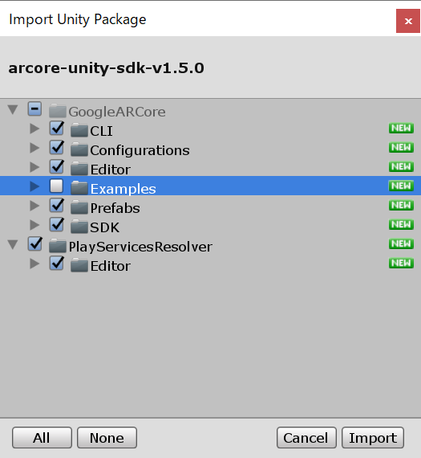
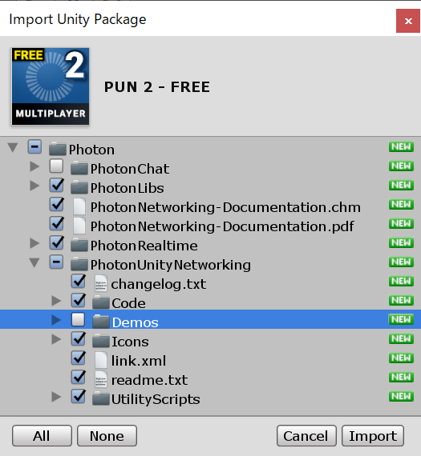

 CrossPlatformSharingDemoUsingAzureSpatialAnchors
This Sample is Cross-Platform(HoloLens and Android)  Sharing Demo using "Azure Spatial Anchors" and "Photon".

## スマホとHoloLensの共演！“Azure Spatial Anchors”で実現するSharingアプリ

de:code 2019 のセッション内容をより深く理解し実践するのに役に立つサンプルコードやツールを提供ということで、HoloLens 2やAzure Knectと同時期に公開されたAzure Spatial Anchorsを活用した簡単なSharingアプリサンプルを作成しました。

このアプリケーションはHoloLensおよびAndroidで通信を相互に行い、お互い位置付近にCubeを表示してコンテンツを共有します。

* お互いのコンテンツの位置合わせに「Azure Spatial Anchors」を利用しています。
* 通信には「Photon」というプラットフォームを活用しています。

### 開発環境

このサンプルは以下の環境の下で作成、動作確認をしています。

#### ハード
* PC
  * Windows 10 Pro(OSバージョン 1809)
* HoloLens
  * 
* Zenfone AR
* NEXUS 6P

#### ソフトウェア
* Unity 2018.3.6f1
* Visual Studio 2017(15.9.11)
* [ARCore 1.5](https://github.com/google-ar/arcore-unity-sdk/releases/tag/v1.5.0)  
※最新のAzure Spatial Anchorのドキュメントは1.7.0ですがこれは最近Azure Spatial Anchorがレベルアップしたため
* [PUN 2 - Free版(2.12)](https://assetstore.unity.com/packages/tools/network/pun-2-free-119922)

### 開発に必要な前準備
#### Azure等の環境
このサンプルはZure Spatial Anchorのクイックスタートと導入手順は同じになります。前提条件、開発に必要なAzureの構築は以下のサイトを参照してください。  
[クイック スタート:Azure Spatial Anchors を使用する HoloLens Unity アプリを作成する](https://docs.microsoft.com/ja-jp/azure/spatial-anchors/quickstarts/get-started-unity-hololens)

#### アンカー共有サービスのデプロイ
アンカーの共有を行うためにそられの情報へのアクセスを容易にするためのサンプルとしてAzure Spatial Anchorのチュートリアルではアンカー共有サービスを構築しています。今回のサンプルもこのサイトの機能を利用しますので手順に従って準備をお願いします 。  
[チュートリアル:セッションやデバイス間での Azure Spatial Anchors の共有 - アンカー共有サービスのデプロイ](https://docs.microsoft.com/ja-jp/azure/spatial-anchors/tutorials/tutorial-share-anchors-across-devices#deploy-your-sharing-anchors-service)

#### Photonサービスの登録
[Photon](https://www.photonengine.com/ja-JP/Photon)はクロスプラットフォームで利用できるマルチプレイヤープラットフォームです。UNETのように手軽さで簡単にマルチプレイヤー用のアプリケーション開発が可能です。Free版は20同時アクセス（上限通信量60GB)で利用できます。
Photonへのサービス登録とPUN(Pothon Unity Networking)用のアプリケーションIDの取得を実施してください。

### 利用手順

1. Gitからこのリポジトリをクローンまたはダウンロードする。
2. Unityで開く
3. [Asset]-[Import Package]-[Custom Package]を開きあらかじめダウンロードした[ARCore](https://github.com/google-ar/arcore-unity-sdk/releases/tag/v1.5.0) 用のunitypackageをインポートする（サンプル以外）。  

4. Asset Storeから [PUN 2 - Free版(2.12)](https://assetstore.unity.com/packages/tools/network/pun-2-free-119922)をインポートする(チャットとDemo以外)。  

5. デプロイする。[File]-[Build Settings]を選択しビルドを実施する。
  * Androidの場合は [Platform]を[Android]に変更し[Switch Platform]を行う。使用するAndroidのバージョンに合わせて[Player Settings]のAndroid OSバージョンを変更します（Zenfone AR > 7.0,NEXUS 6P > 8.0)
  * HoloLensの場合は、[Platform]を[Universal Windows Platform]に変更し[Switch Platform]を行う。

### 実行について

1. HoloLensにデプロイしたアプリケーションを開く。
  1. メッセージが表示されたらAirTapを行う。
  2. クラウド上にAnchorがないことを表すメッセージが表示されるので**床面**に顔を向けAirTapを行う
  3. Cubeが生成され周辺の空間環境を収集します  
  ※HoloLensの場合常にSpatial Mappingが実行されている状態なので一瞬で終わります。スマホの場合はAnchor周辺をうろうろして情報を取ってください。
  4. セーブが完了するとパネルが表示されます。パネルにGazeしてAirTapするとPhotonサーバに接続を行いネットワークが開始されます。
2. Androidにデプロイしたアプリケーションを開く
  1. 10秒ほど待つ。（アンカー共有サービスからの情報連携に少し時間がかかるため）
  2. 画面上のボタンを押す
  3. Locating Anchorというメッセージが表示されたら**床面**を見渡す。  
  Anchorを設置した付近の空間情報に一致する場所にCubeが生成される。
  4. テキストボックスとボタンが表示されるので、適当な名前を入力しボタンを押下するとPhotonさばーに接続を行いネットワークが開始されます。
3. お互いを認識する。
  それぞれの端末はCubeで表現されています。それぞれの方向を見るとCubeが見え、動いている状況が見えます。Androidの場合ARCoreの空間認識できる範囲内にアンカーがないと動作が不安定になります。
  
### Azure Spatial Anchorの面白いところ
Azure Spatial Anchorはクラウド上にアンカーとその周辺の空間情報を持つことでクロスプラットフォームで空間情報を活用したコンテンツ共有が可能です。
今回は使っていませんが、クラウドに送信する際にアンカー自体に情報を埋め込むことができるため、例えばある空間に設置したアンカーをダウンロードして埋め込んだ情報を使ってオブジェクトを表示するなども可能です。MineCraftのAR版はこのAzure Spatial Anchorsを利用しているので、比較的容易にこのような空間情報とコンテンツをリンクするアプリを作ることが可能です。また、HoloLensのような高価な機器だけで実現していたことを安価なデバイスでも利用できるメリットも注目です。精査な空間情報はHoloLensやAzure Kinectで収集し、安価なスマホでその情報を活用するというようなXRの世界が広がる注目の技術だとおもいます！

### アプリについて
Azure Spatial Anchorsはサービスの特性上、一度アップロードした情報は残り続けます。このためこのサンプルではHoloLensの場合は、起動時にAnchorsをすべて削除します。このためHoloLens同士の場合はそのロジックを外す必要があります。修正箇所は
AzureSpatialAnchorsSharedAnchorDemoScript.StartSpatialAnchorsの中にあります（TODOで記載）
ベースにいているものはチュートリアルの以下の内容です。  
[チュートリアル:セッションやデバイス間での Azure Spatial Anchors の共有](https://docs.microsoft.com/ja-jp/azure/spatial-anchors/tutorials/tutorial-share-anchors-across-devices#deploy-your-sharing-anchors-service)

© 2019 Takahiro Miyaura All rights reserved.
本コンテンツの著作権、および本コンテンツ中に出てくる商標権、団体名、ロゴ、製品、サービスなどはそれぞれ、各権利保有者に帰属します。
